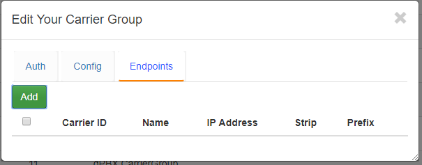

Carrier Groups
^^^^^^^^^^^^^^

The Carrier Group section of dSIPRouter allows you to define carriers.  IP Authentication and Username/Password authentication 
to carriers are supported

.. image:: images/carrier_groups.png
        :align: center
        
Adding a Carrier
^^^^^^^^^^^^^^^^

- Click "Add" to create a Carrier Group.  A carrier group can contain 1 or more SIP endpoints provided by the carrier. Select Username/Password Auth, fill in the appropiate fields.

.. image:: images/add_carrier_group.png
        :align: center

After you have added the new group, the screen will return back to the List of Carriers Group page. Select the pencil in the blue box to the right to allow editing the Config and Endpoints. 

To update the Config, slecet the Config tab to edit/ change the Carrier group name. Then click Update.

.. image:: images/config_pic.PNG
        :align: center
        
To add an endpoint, selct the blue pencil and click the Endpoint tab. Click ADD, enter the carrier details then click ADD again.  

        

.. image:: images/add_carrier_details.PNG
        :align: center
        
        
       
       
       
 
 
 
 You should now see your added carrier in the Carrier Group List.
