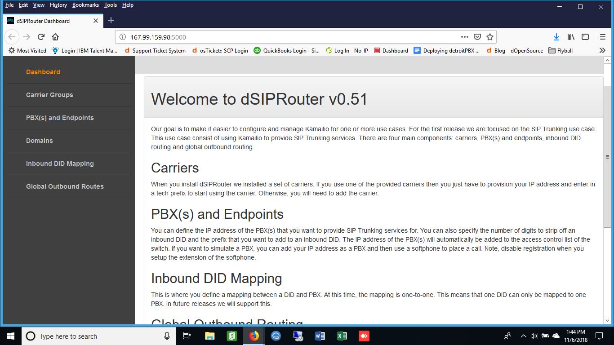
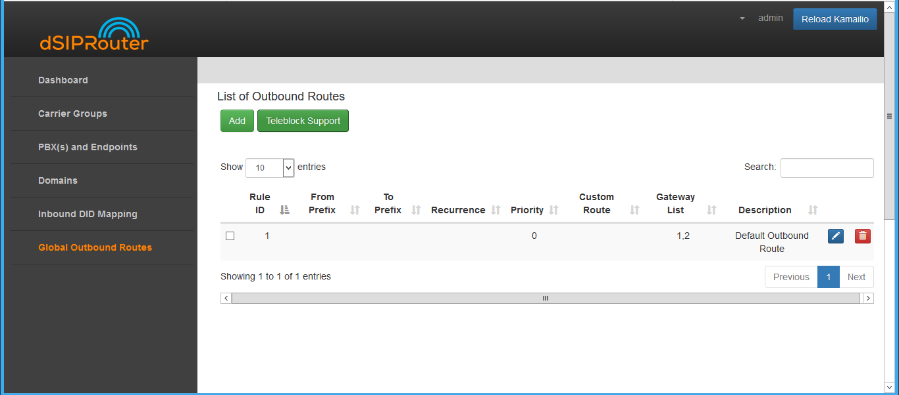

.. _global_outbound_routes:

Global Outbound Routes
^^^^^^^^^^^^^^^^^^^^^^^^

1) Go to the Dashboard screen.

2) Click on Global Outbound Routes.

3) Click on the green Add button.

4) 
  a) Enter in the Outbound Route information.
  b) Click on the green Add button.

.. image:: images//dSIP_Global_Out_Add_Outbound_Route.png
        :align: center
        
        
5) Click on the blue Reload Kamailio button in order for the changes to be updated.

