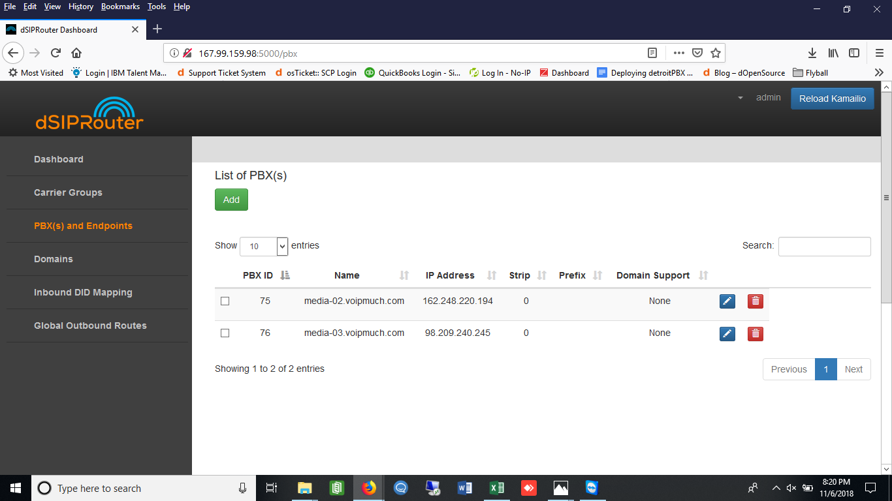
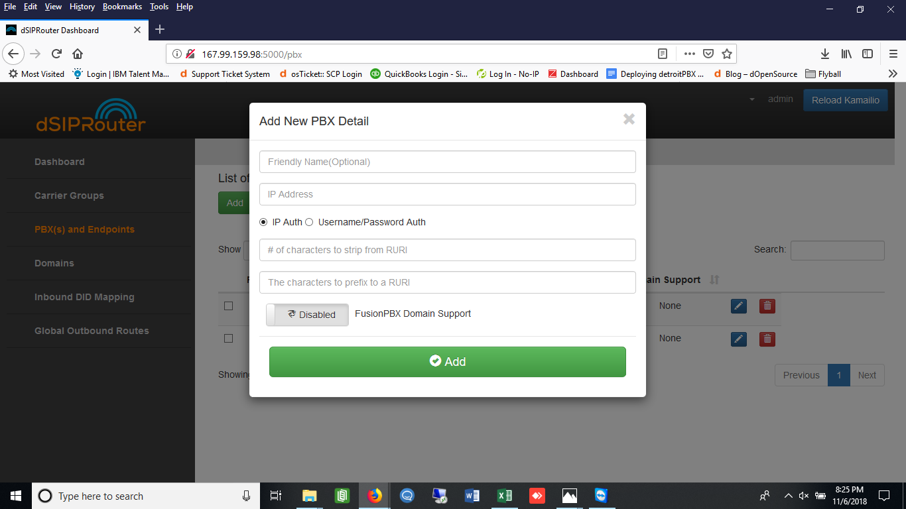
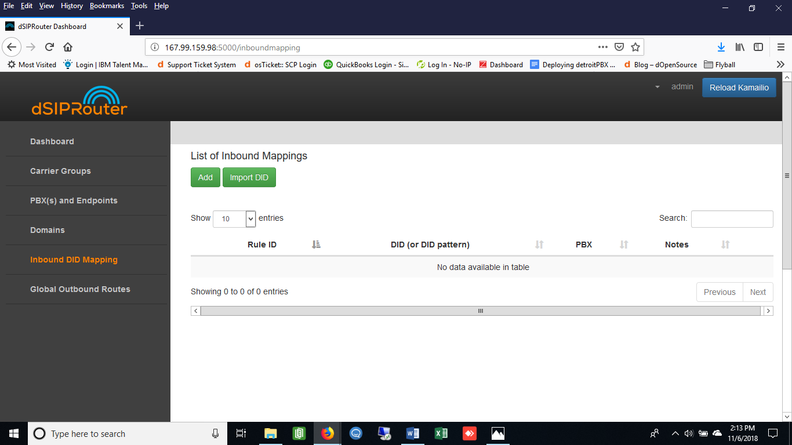
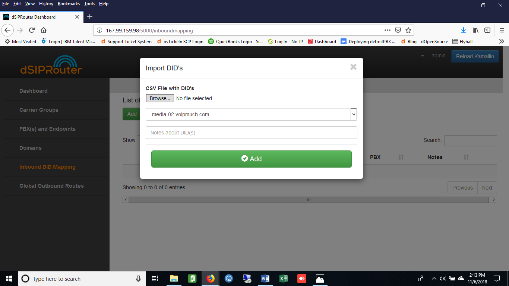
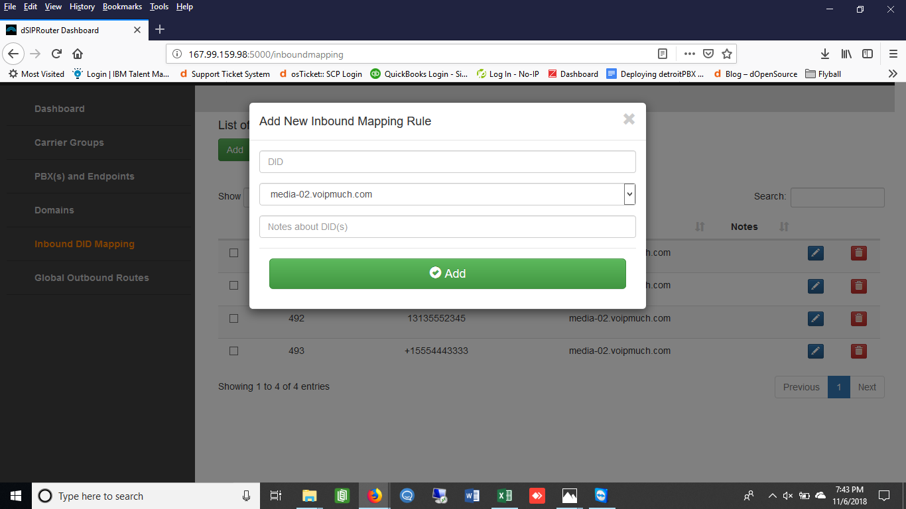

PBX(s) and Endpoints
======================

Allows you to define a PBX or Endpoint that will send or receive calls from dSIPRouter.  The PBX or Endpoint can use IP 
authentication or a username/password can be defined.

To add a PBX:
^^^^^^^^^^^^^^^^
1) Go to the Dashboard screen.

.. image:: images//dSIP_dashboard.png
        :align: center

2) Click on PBX(s) and Endpoints.

3) Click on the green Add button.

4) 
        a)Enter in the PBX info.
        
        
        
        b)Click the green Add button.
        
          
        

5) Click on the blue Reload Kamailio button in order for the changes to be updated.

Inbound DID Mapping
======================

To Import a DID from a CVS file:
^^^^^^^^^^^^^^^^

1) Go to the Dashboard screen.

.. image:: images//dSIP_dashboard.png
        :align: center
        
             
       
2) Click on Inbound DID Mapping.

        
        
       
3) Click on the green Import DID button underneath List on Inbound Mappings.

        
        
       
4) 
        a)Click the Browse button and select the file that contains the DID numbers that you wish to use. 
        
        
        
        b)Click the green Add button. 

Click `CSV Example <https://raw.githubusercontent.com/dOpensource/dsiprouter/v0.51/docs/images/DID_test.csv>`_ to view a sample of the .CSV file

5) Click on the blue Reload Kamailio button in order for the changes to be updated.

Click here to see an example of a csv file.

To Manually import a DID:
^^^^^^^^^^^^^^^^^^^^^^^^

1) Go to the Dashboard screen.

.. image:: images//dSIP_dashboard.png
        :align: center
        
    
    
2) Click on Inbound DID Mapping.

        
        
       
3) 
        a)Click on the green ADD button underneath List on Inbound Mappings. 
   
   
   
        b)On the next screen, enter the DID number in the DID field. 
        
        
        
        c)Select the PBX from the PBX drop-down menu.
        
        
        
        d)Click the green Add button.
        
        
        

4) Click on the blue Reload Kamailio button in order for the changes to be updated.

