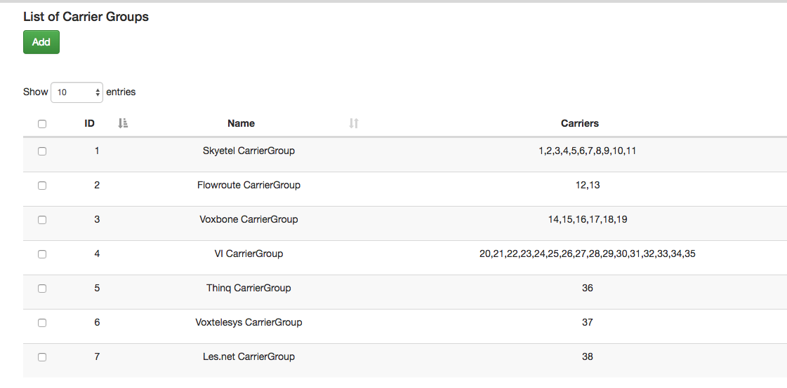
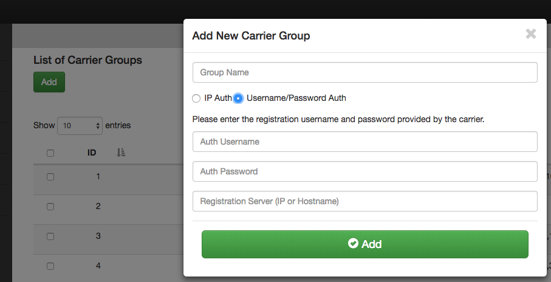

.. _carrier_groups:

Carrier Groups
^^^^^^^^^^^^^^

The Carrier Group section of dSIPRouter allows you to define which carriers will be used to provide Internet service (aka ISP) for your VOIP (Voice Over IP) services. Carrier groups support IP Authentication and Username/Password authentication. Below is an example of a carrier groups list.

        
Adding a Carrier
^^^^^^^^^^^^^^^^

- Log into dSIPRouter using proper username and password.

- Click "Add" to create a Carrier Group.  A carrier group can contain 1 or more SIP endpoints provided by the carrier. A SIP Endpoint represents a device that makes or receives calls via your Gateway. This could be a physical IP phone, a softphone app such as Skype, on a PC or smartphone, an Analog Telephone Adapter (ATA) such as for fax machines, or even a PBX system. 

- Select Username/Password Auth, fill in the username, password of your registration server and the registration server name. Then click ADD.

NOTE: Click IP authenication to use only the IP address of your PBX/endpoint.

.. image:: images/IP_authenication.png
       :align: center

For example:   

.. image:: images/username_password.png
        :align: center

After you have added the new group, the screen will return back to the List of Carriers Group page. Select the pencil in the blue box to the right to allow editing the Config and Endpoints. 

.. image:: images/carrier_editing.png
        :align: center

Select the Config tab. The Config tab allows you to edit/change the Carrier group name. Then click Update.

.. image:: images/config_pic.png
        :align: center
        

To add an Endpoint, click the Endpoint tab. 

.. image:: images/add_endpoint.png
        :align: center
       
Click ADD, enter the Friendly name (optional), the IP address of the endpoint/device, # of characters to strip from RURI, the character to prefix to a RURI then click ADD again.  For example, if a PBX sends a number over as 914443332222 but the carrier wants the number to be sent as 14443332222 then the # of characters to strip should be defined as 1, which would strip off the 9. Some carriers request added digits (aka Prefixes) in front of the phone number.

.. image:: images/add_new_carrier_details.png
 :align: center

Edit and click ADD again to add addtional endpoints. Click the gray X in that box to save the window and close.

You should now see your added carrier with endpoints in the Carrier Group List.

.. image:: images/carrier_group_list.png
 :align: center

 
Be sure to click the Reload Kamailio button to apply changes.
   

.. image:: images/reload_button.png
 :align: center
 
 
 
 
 
 
