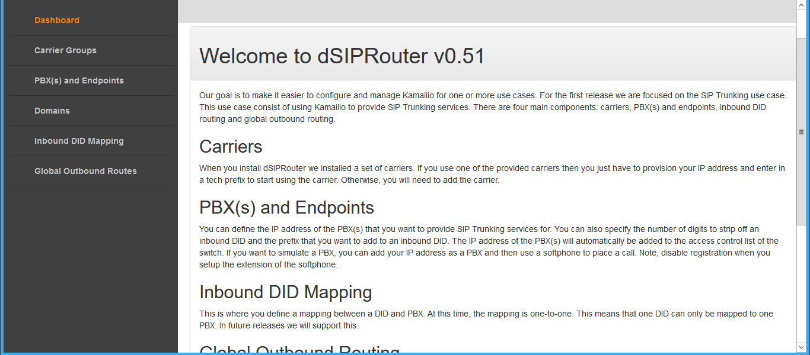
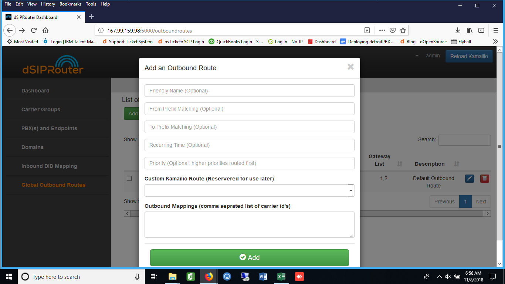

.. _global_outbound_routes:

Global Outbound Routes
^^^^^^^^^^^^^^^^^^^^^^^^

1) Go to the Dashboard screen.

2) Click on Global Outbound Routes.

3) Click on the green Add button.

.. image:: images//dSIP_Global_Out_Add.png
        :align: center

4) 
  a) Enter in the Outbound Route information.
  b) Click on the green Add button.

  From Prefix:
    This is matched against the SIP From: header. The from header typically contains the SIP Username.
    You can specify a prefix here to tell dSIPRouter to use the specified Carrier Group on a match.

  To Prefix:
    This is matched against the SIP To: header. Depending on your PBX deployments, you may wish to have
    your clients prefix their outbound calls with a custom 'prefix'. This can be used to provide an extra
    layer of security for IP Authenticated calls. (Much like Flowroutes' TechPrefix.
    Specifcy a prefix here only if you expect to receive a prefix from your client.
  
  Recurring Time:
    Unknown at this time.
    
  Custome Kamaillio Route:
    This currently does not have an option to provide custom routes.
  
  Carrier Group:
    Specify the Carrier Group you wish to use to deliever calls made to this outbound route.
    You may want to create additional custom Carrier Groups, perhaps with different failover providers listed, to 
    provide a redundant failover.
    

        
        
5) Click on the blue Reload Kamailio button in order for the changes to be updated.

