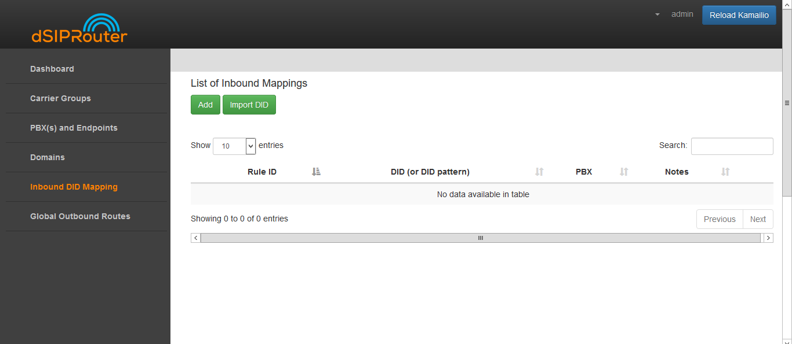
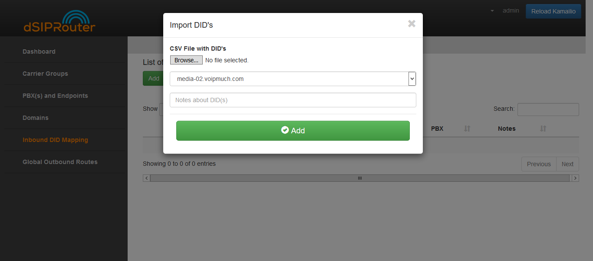

PBX(s) and Endpoints
======================

Allows you to define a PBX or Endpoint that will send or receive calls from dSIPRouter.  The PBX or Endpoint can use IP
authentication or a username/password can be defined.

To add an Endpoint Group:
^^^^^^^^^^^^^^^^^^^^^^^^^

1) Click on Endpoints Groups.

2) Click on the green Add button.

.. image:: images//dSIP_PBX_Add.png
        :align: center

3) Configure the Endpoint Group

     The Endpoint Tab is where you specify the endpoints that will be signaling
     with dSIPRouter.  The weight field allows you to define how much SIP traffic
     is distributed to a particular endpoint. If you don't specify a weight for an endpoint
     the system will automatically generate a weight.  If you are using FusionPBX Domain
     Auth then Register and INVITE requests will be distributed to the endpoints based
     upon the weights.  You will also have the option to route Inbound calls to the
     endpoints based on the weights by selecting the name of the Endpoint Group with
     an LB concatenated to the name.  For example, if the name of the Endpoint Group is
     **PBXCluster** then you would select **PBXCluster LB** from the Inbound Mapping
     Endpoint Group drop down.

  b) Click the green Add button.

.. image:: images//dSIP_PBX_ADD_New_PBX.png
        :align: center

4) Click on the Reload Kamailio button in order for the changes to be updated.

Inbound DID Mapping
======================

To Import a DID from a CSV file:
^^^^^^^^^^^^^^^^^^^^^^^^^^^^^^^^

1) Click on Inbound DID Mapping.

2) Click on the green Import DID button underneath List on Inbound Mappings.

3) Click the Browse button and select the file that contains the DID numbers that you wish to use.

4) Click the green Add button.

  Click `CSV Example <https://https://raw.githubusercontent.com/dOpensource/dsiprouter/master/gui/static/template/DID_example.csv>`_ to view a sample of the .CSV file

5) Click on the Reload Kamailio button in order for the changes to be updated.

To Manually import a DID:
^^^^^^^^^^^^^^^^^^^^^^^^^

1) Click on Inbound DID Mapping
2) Click on the green ADD button.

  - Enter the name of the Inbound mapping
  - Enter the DID number in the DID field.
  - Select the Endpoint Group from the drop-down list

      Note: Each endpoint will contain at least two entries.  One that leverages load balancing weights and another that randomly selects an endpoint.
      The one denoted with a LB is the one that uses the load balancing algorithm.  If FusionPBX Domain Support is enabled you will see an additional
      entry for routing to the external interface of the FusionPBX server.

  - Click the green Add button.

  .. image:: images//dSIP_IN_DID_Map.png
          :align: center

3) Click on the Reload Kamailio button in order for the changes to be updated.
