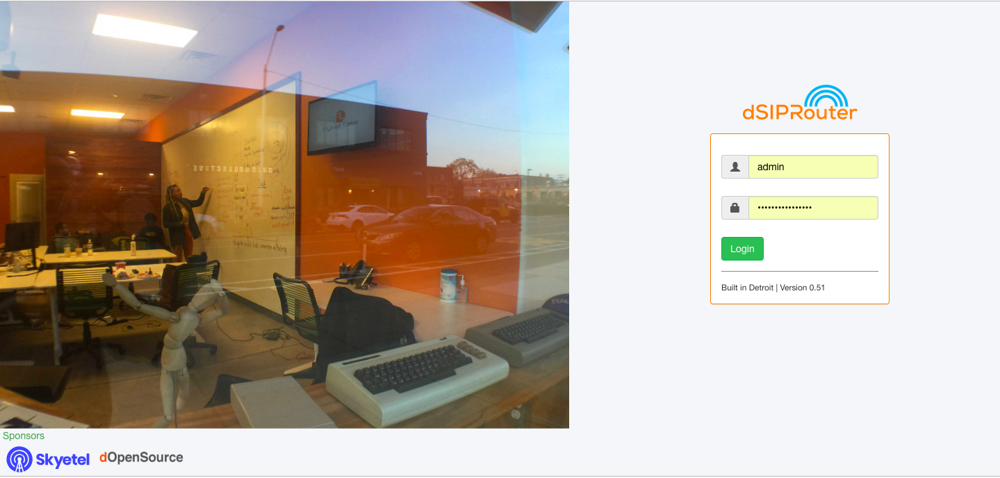

In this section we will show you how to upgrade from 0.50 to 0.51.

Before starting the upgrade process you will need to backup your kamailio database using the following command: 

.. code-block:: bash
  
  cd /opt/
  mysqldump kamailio > kamailio-bk.sql

After you've backed up your database you can now uninstall dsiprouter v0.50 by running the following commands: 

.. code-block:: bash

  cd /opt/dsiprouter
  ./dsiprouter.sh uninstall

Once the uninstall is complete you will need to either move or delete the /dsiprouter directory using the following command.

.. code-block:: bash
  
  mv /dsiprouter /usr/local/src (moving directory)

Alternatively:

.. code-block:: bash

  rm -r /dsiprouter (removing directory)

Installing dsiprouter v0.51

.. code-block:: bash
  
  cd /opt/
  apt-get update
  apt-get install -y git curl
  cd /opt
  git clone -b v0.51 https://github.com/dOpensource/dsiprouter.git
  cd dsiprouter
  ./dsiprouter.sh install

**Note: please take note of the credentials given after the script has completed.**

After the install is completed you can now restore your kamailio database using the following command:

.. code-block:: bash
  
  cd /opt/
  mysql  kamailio < kamailio-bk.sql

After the kamailio database is restored you need to restart dsiprouter using the following commands:

.. code-block:: bash
  
  cd /opt/disprouter/
  ./dsiprouter.sh restart 

After the install is complete and the dsiprouter service has been restarted, the login screen should now reflect v0.51 and you should be able to login with the dsiprouter credentials provided after the install completed.

