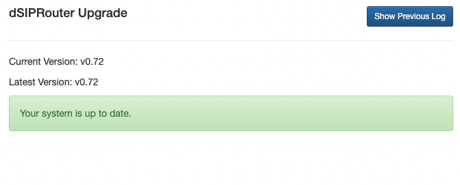

.. _upgrading:

Upgrading dSIPRouter
====================

Auto Upgrade Feature
--------------------

The dSIPRouter auto upgrade feature was released in 0.72 but was not feature complete until 0.73.
It allows you to upgrade dSIPRouter from the User Interface (UI) and the command line (CLI).
If you are upgrading from 0.70, 0.72, or 0.721 you can boostrap to the latest release to get the auto-upgrade feature.

Upgrading to 0.73 doesn't require a dSIPRouter Core Subscription license because the auto-upgrade framework was not yet feature complete.
However, future releases of dSIPRouter will require a Core Subscription License to use the auto-upgrade feature.
A core license can be purchased from the `dSIPRouter Marketplace <https://dopensource.com/product/dsiprouter-core/>`_.

Upgrade 0.72x to 0.73
---------------------

Upgrading to 0.73 can be done from 0.72 or 0.721 by doing the following

1. SSH to your dSIPRouter Instance
2. Run the following command

.. code-block:: bash

   curl -s https://raw.githubusercontent.com/dOpensource/dsiprouter/v0.73/resources/upgrade/v0.73/scripts/bootstrap.sh | bash

3. Login to the dSIPRouter UI to validate that the upgrade was successful.

**Note**, if you are upgrading from a debian 9 system you must first upgrade OS versions to a supported version.
See the `debian upgrade <https://wiki.debian.org/DebianUpgrade>`_ documentation for more information.

Note, if the upgrade fails you can purchase a dSIPRouter Core Subscription from the `dSIPRouter Marketplace <https://dopensource.com/product/dsiprouter-core/>`_.
This will provide you with support hours so that we can help with the upgrade.

Upgrade 0.70 to 0.721
---------------------

You can upgrade from 0.70 by doing the following

1. SSH to your dSIPRouter Instance
2. Run the following command

.. code-block:: bash

   curl -s https://raw.githubusercontent.com/dOpensource/dsiprouter/v0.721/resources/upgrade/v0.721/scripts/bootstrap.sh | bash

3. Login to the dSIPRouter UI to validate that the upgrade was successful.  

Note, if the upgrade fails you can purchase a dSIPRouter Core Subscription which can be purchased from the `dSIPRouter Marketplace <https://dopensource.com/product/dsiprouter-core/>`_.
This will provide you with support hours so that we can help with the upgrade.

Upgrade 0.70 to 0.72
--------------------

This upgrade path is deprecated. Upgrade to the **0.721** release instead.

Upgrade 0.644 to 0.70
---------------------

There is no automated upgrade available from 0.644 to 0.70.
Support is available via a dSIPRouter Core Subscription which can be purchased from the `dSIPRouter Marketplace <https://dopensource.com/product/dsiprouter-core/>`_.This will provide you with support hours so that we can help with the upgrade.

Upgrade 0.621 to 0.63
---------------------

.. include:: upgrade_0.621_to_0.63.rst

Upgrade 0.522 to 0.523
----------------------

.. include:: upgrade_0.522_to_0.523.rst

Upgrade 0.50 to 0.51
--------------------

.. include:: upgrade_0.50_to_0.51.rst
