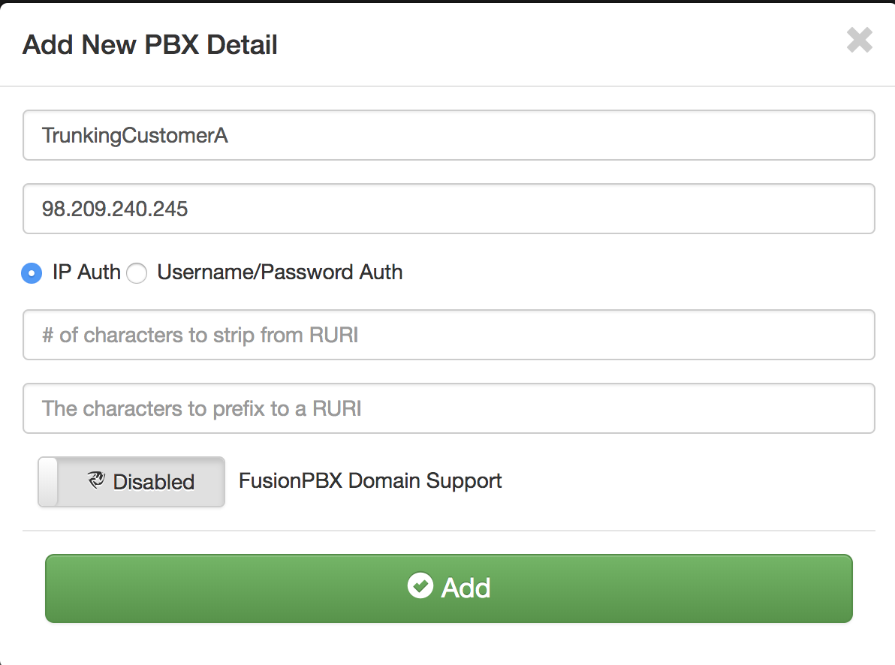
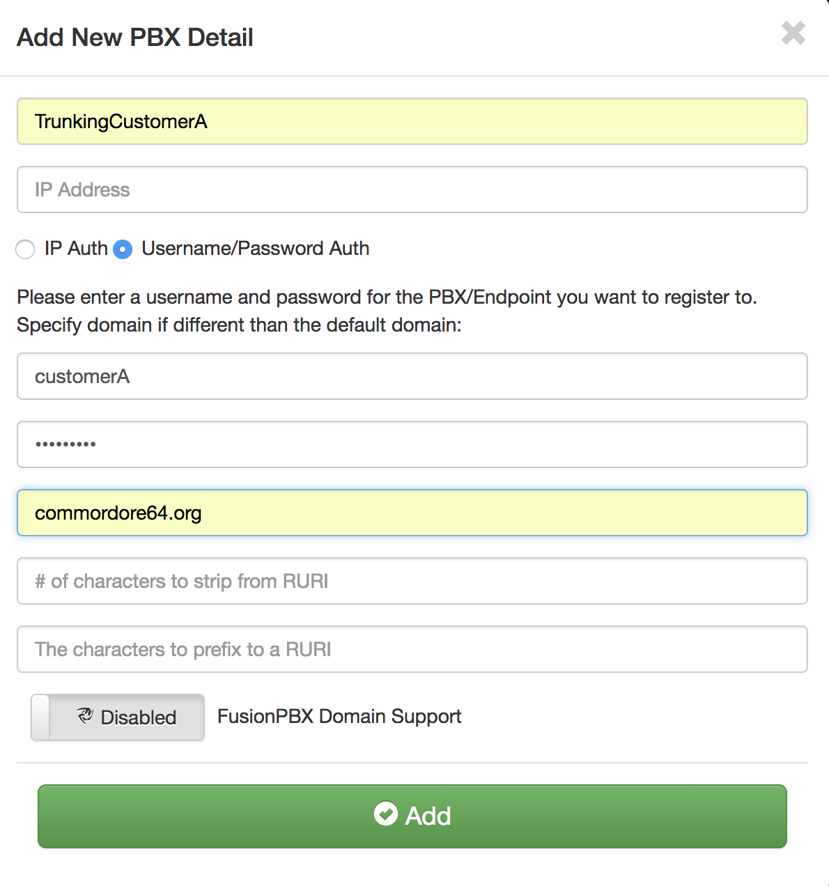
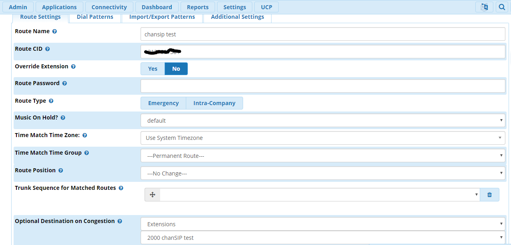
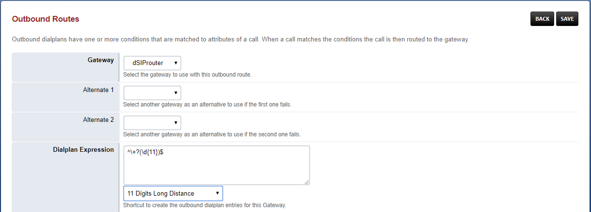
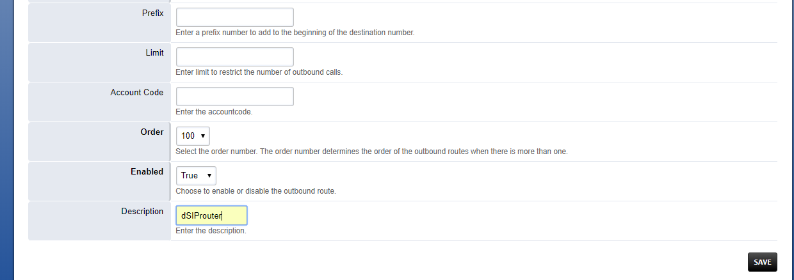
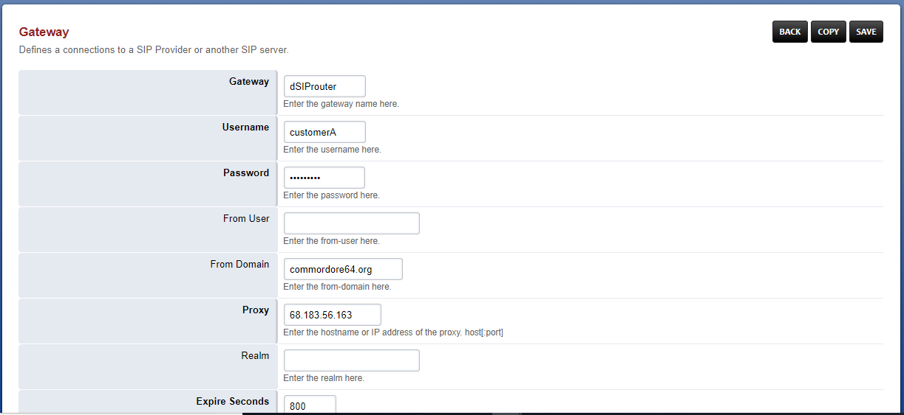
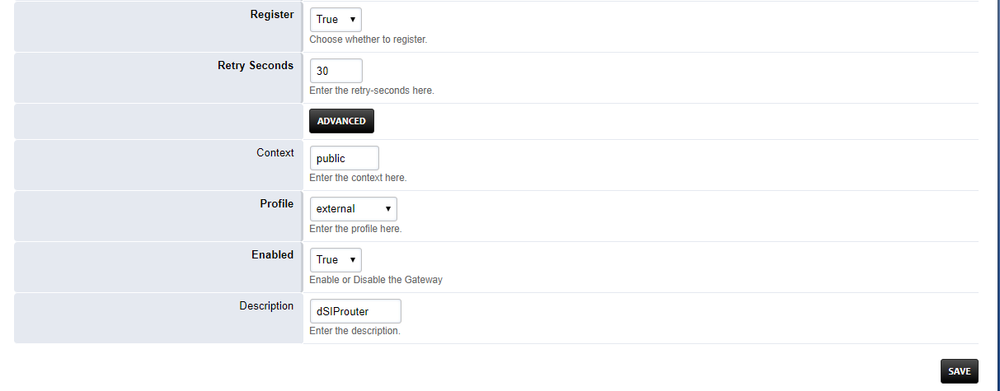
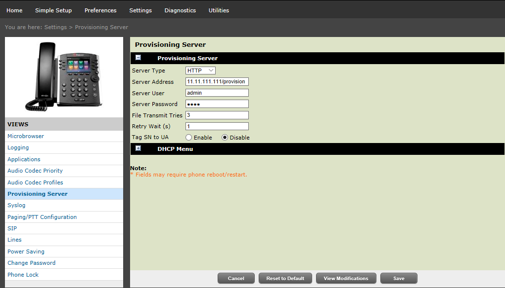
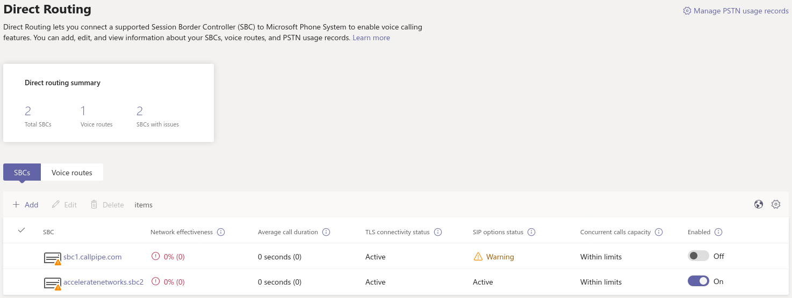
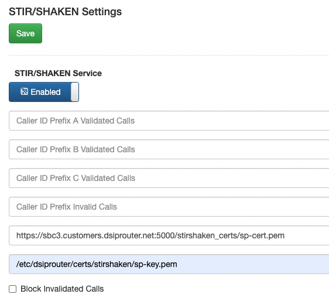

Common Use Cases
================

This section contains a list of the common use cases that are implemented using dSIPRouter

SIP Trunking Using IP Authentication
------------------------------------

dSIPRouter enables an organization to start supporting SIP Trunking within minutes.
Here are the steps to set it up using IP Authentication:

1. Login to dSIPRouter
2. Validate that your carrier is defined and specified in the Global Outbound Routes.  If not, please follow the steps in :ref:`carrier_groups`_ and/or :ref:`global_outbound_routes`_ documentation.

3. Click on PBX's and Endpoints
4. Click "Add" 
5. Select **IP Authentication** and fill in the fields specified below: 

- Friendly Name
- IP Address of the PBX or Endpoint Device

6. Click "Add"
7. Click "Reload" to make the change active.

SIP Trunking Using Username/Password Authentication 
---------------------------------------------------

Here are the steps to set it up using Username/Password Authentication:

1. Login to dSIPRouter
2. Valiate that your carrier is defined and specified in the Global Outbound Routes.  If not, please follow the steps in `<carrier_groups.rst>`_ and/or `<global_outbound_routes>`_ documentation.
3. Click on PBX's and Endpoints
4. Click "Add"  
5. Select  **Username/Password Authentication** and fill in the fields specified below: 

- Friendly Name
- Click the "Username/Password Auth" radio button
- Enter a username
- Enter a domain. Note, you can make up the domain name.  If you don't specify one then the default domain will be used, which is sip.dsiprouter.org by default.
- Enter a password

6. Click "Add"
7. Click "Reload" to make the change active.

Using PJSIP Trunking  - FreePBX Example
---------------------------------------

The following screenshot(s) shows how to configure a PJSIP trunk within FreePBX for Username/Password Authentication.  

The first screenshot shows the General tab of the  "pjsip settings" page:

.. image:: images/sip_trunking_freepbx_pjsip_1.png
        :align: center
        
The following fields needs to be entered

==================  ===============================================
Field               Value
==================  ===============================================
Username            Username from dSIPRouter PBX Setup
Secret		        Password from dSIPRouter PBX Setup
Authentication      Outbound
Registration        Send
SIP Server          Domain name defined in the dSIPRouter PBX Setup
SIP Server          SIP port, which is 5060 in dSIPRouter
==================  ===============================================

.. image:: images/sip_trunking_freepbx_pjsip_2.png
    :align: center

The following fields needs to be entered

==================   =============================================================
Field                Value
==================   =============================================================
Outbound Proxy       IP address of dSIPRouter - must include the "\;lr" at the end
From Domain          The name of the domain defined in the dSIPRouter PBX Setup
==================   =============================================================

Using chanSIP Trunking  - FreePBX Example
-----------------------------------------

The following screenshot(s) shows how to configure a chanSIP trunk within FreePBX for Username/Password Authentication.

1. Log into FreePBX server
2. Click Connectivity→Trunks
3. Select Add SIP (chan_sip) Trunk
4. Under General tab enter 
  
The following fields needs to be entered

==================   =====================================================================
Field                Value
==================   =====================================================================
Trunk Name           Labeled in dsiprouter
Outbound Caller ID   Phone# that you want to appear during a outbound call (if applicable)
==================   =====================================================================

.. image:: images/sipchan_general.png
    :align: center

5. Next you will enter the configurations under the SIP Settings. Here you will enter the SIP settings for outgoing calls by selecting the **Outbound** tab. You will need the following information:
The following fields needs to be entered

==================   =======================================
Field                Value
==================   =======================================
Host                 <host name or IP address of dsiprouter> 
Username             <Specified in dsiprouter@domainname>
Secret               <Specified in dsiprouter>
Type                 peer
Context              from-trunk
==================   =======================================

**The domain name has to be included and correct.**

.. image:: images/chansip_outgoing.png
    :align: center

NOTE:** Type <context=from-trunk> underneath the <type=peer> in the Peer Details box if it does not appear.

6. Next you will enter the configurations for incoming by selecting the **Incoming** tab in the SIP Settings. Here you will enter the SIP settings for inbound calls. You will need:

User Context: This is most often the account name or number your provider expects. In this example we named it "inbound".
The following User Details needs to be entered:

==================   =======================================
Field                Value
==================   =======================================
Host                 <host name or IP address of dsiprouter>
Insecure             port,invite
Type                 peer
Context              from-trunk
==================   =======================================

.. image:: images/chansip_incoming.png
    :align: center

In the **Register String** enter: <username@domainname>:<password>@<ip address **or** hostname>. In this example it would be sipchantest@sip.dsiprouter.org:HFmx9u9N@demo.dsiprouter.org. **The domain name has to be included and correct.**

.. image:: images/register_string.png
    :align: center

7. Click Submit

8. Be sure to click the **Apply Config** button after submitting to confirm.

.. image:: images/apply_config_button.png
    :align: center

You will now be able to see the new chanSIP added in the truck.	

.. image:: images/add_trunk.png
    :align: center

9. Next you will need to setup an outbound route. Select Connectivity→ Outbound Routes. Click the “+” sign to add a outbound route. In this tab you will need to enter:

=================================   ======================================
Field                               Value
=================================   ======================================
Route Name                          Type desired name
Route CID                           Number you want to appear on caller ID
Trunk Sequence for Matched Routes   Trunk name (select from drop down box)
=================================   ======================================

10. Click the Dial Patterns tab to set the dial patterns. 
If you are familiar with dial patterns, you can enter the dial patterns manually or you can click the Dial Patterans Wizard to auto create dial patterns if you like. You can choose 7, 10 or 11 digit patterns. Click Generate Routes.

.. image:: images/chansip_dial_wizard.png
    :align: center

Dial pattern is set to your preference. Prefixes are optional, not required.

.. image:: images/chansip_dial_pattern.png
    :align: center

11. Click Submit and Apply Config button.

Assuming you already have an extention created in your FreePBX, you can validate incoming/outgoing calls by configuring a softphone or a hard phone. Below is an example of the information you would enter if you use a softphone: In this example we are using Zoiper. Once you’ve downloaded Zoiper application on your PC or smart device you would enter the following to configure the soft phone:
		
==================  ==============================================
Field               Value
==================  ==============================================
Username            <extension>@<siptrunkipaddress>
secret              <Password of that extension>
Hostname	        <IP address of your FreePBX> (should autofill)
==================  ==============================================

**Note** Skip Authenication and Outbound Proxy

.. image:: images/chansip_zoiper.png
    :align: center

You should now be able to make a inbound and outbound call successfully!

Using SIP Trunking - FusionPBX IP Authenication
-----------------------------------------------

The following screenshot(s) shows how to configure a SIP trunk within FusionPBX for IP Authenication.

1. Log into your FusionPBX. 
2. Click Accounts --> Gateways-->Click the + sign to add a gateway/SIP Trunk. The only fields you will need to fill here are:
    - Gateway= Name of the SIP Trunk
    - Proxy= IP address of the SIP trunk
    - Register= Change to False because you are using IP authenication

.. image:: images/sip_trunking_fusionpbx.png
    :align: center

.. image:: images/sip_trunking_fusionpbx_2.png
    :align: center

3. Click Save
4. Click DialPlan-->Outboung Routes-->Click the + sign to add a outbound route. Here you will enter in the following fields:
    - Gateway= Name of the SIP Trunk
    - Alternate gateways (if applicable)
    - DialPlan Expression= 11d (standard setup in FusionPBX). To change the dialplan expression click on the dropdown box where it says "Shortcut to create the outbound dialplan entries for this Gateway."
    - Description= (if desired)
5. Click Save

**NOTE** To make these changes global for ALL domains for this SIP Trunk: reopen outbound routes and change the Domain to Global and the Context to ${domain_name} as shown below. 

.. image:: images/fusionpbx_global_dialplan.png
    :align: center

Using SIP Trunking - FusionPBX Username/Password Authenication
--------------------------------------------------------------

The following screenshot(s) shows how to configure a SIP trunk within FusionPBX for Username/Password Authenication with IP Authenication off.

1. Log into your FusionPBX. 
2. Click Accounts --> Gateways-->Click the + sign to add a gateway/SIP Trunk. The following fields you will need to fill here are:
    - Gateway= Name of the SIP Trunk
    - Username= specified by dSIPRouter provider
    - Password= specified by dSIPRouter provider
    - From Domain= Specified or set by default
    - Proxy= IP address of the SIP trunk
    - Register= set to True because you are using Username/Password authenication.

3. Click Save.
4. Click DialPlan-->Outboung Routes-->Click the + sign to add a outbound route. Here you will enter in the following fields:
    - Gateway= Name of the SIP Trunk
    - Alternate gateways (if applicable)
    - DialPlan Expression= 11d (standard setup in FusionPBX). To change the dialplan expression click on the dropdown box where it says "Shortcut to create the outbound dialplan entries for this Gateway."
    - Description= (if desired)

5. Click Save

FusionPBX Hosting
-----------------

Here we will demostrate how to setup dSIPRouter to enable hosting FusionPBX. We have built-in support for FusionPBX that allows domains to be dynamically pulled from FusionPBX.
 
1. Login to dSIPRouter
2. Click PBX(s) and EndPoints
3. Click ADD; enter the following fields
    - Friendly Name (opional)
    - IP address
    - IP Auth
    - Click to enable FusionPBX Domain Support
    - FusionPBX Database IP or Hostname
4. Click ADD

.. image:: images/fusionpbx_hosting.png
    :align: center

5. Click Reload Kamailio. (when changes are made reload button will change to orange)          

6. Access your FusionPBX database via ssh.
7. Run the command as illustrated in the "Edit your PBX Detail" window as root on the FusionPBX server. Replace <ip address> (not including the brackets) with the IP address of the dSIPRouter server you're adding. Command line will look simulair to the following picture.

**NOTE** After you have entered the first two lines of commands you will not see a form of reply. If command is entered correctly it will return back to your root line. If the command line is incorrect you will receive a "command not found" error message. Recheck the command line and IP address.

.. image:: images/fusionpbx_domain_support.png
    :align: center

After the command is run you should now be able to see the domains of that PBX in dSIPRouter.

.. image:: images/list_of_domain.png
    :align: center

You can test PBX Hosting is valid by configuring a softphone or a hard phone. Below is an example using a softphone: 
 
Now that domains have been synced in dSIPRouter you are able to register a softphone. In this example we are using Zoiper.
Once you've downloaded Zopier appliaction on your PC or smart device you would add:
 
- username (extension@domainname)
- password (password of that extension)
- outbound proxy (IP address of the dSIPRouter)

.. image:: images/zoiper_screenshot.png
    :align: center

Provisioning and Registering a Polycom VVX Phone
------------------------------------------------

Now that domains have been synced in dSIPRouter you are able to register a endpoint/hard-phone. In this example we are using a Polycom VVX410 desk phone.
 
1. Log into your FusionPBX box
    a) Update the "outboundProxy.address" of the template with the IP address or hostname of the dSIPRouter in the provisioning editor.

.. image:: images/outbound_proxy.png
    :align: center

2. Assign the phone to a template.
 
.. image:: images/assign_template.png
    :align: center

3. Configuring the Provisioning Server section of the phone. Enter the appropriate information into the fields.
    a) Server Type (dSIPRouter uses HTTP by default)
    b) Server Address
    c) Server Username (device provisioning server name)
    d) Server Password
4. Click Save 

5. Reboot the phone

FreePBX Hosting - Pass Thru Authentication
------------------------------------------

Here we will demostrate how to setup dSIPRouter to enable hosting FreePBX using Pass Thru Authentication. FreePBX is designed to be a single tenant system or in other words, it was built to handle one SIP Domain.  So, we use dSIPRouter to define a SIP Domain and we pass thru Registration info to the FreePBX server so that you don't have to change how authentication is done.  However, this will only work for one FreePBX server.  If you have a cluster of FreePBX servers then use "Local Subscriber Table" authentication.  The value of having dSIPRouter in front of FreePBX is to provide you with flexibility.  After setting this up you will have the ability upgrade or migrate users from one FreePBX instance to another without having to take an outage.  The following video shows how to configure this.  The steps to implement this is below the video.

.. raw:: html

    

        <iframe src="https://www.youtube.com/embed/OgTZLYYx1u8" frameborder="0" allowfullscreen style="position: absolute; top: 0; left: 0; width: 560px; height: 385px;"></iframe>
    

Steps to Implement
++++++++++++++++++

1. Click PBX and Endpoints
2. Click Add

.. image:: images/freepbx-pt-add-pbx.png
    :align: center

3. Reload Kamailio
4. Click Domains
5. Click Add

.. image:: images/freepbx-pt-add-domain.png
    :align: center

6. Reload Kamailio
7. Register a phone via dSIPRouter - notice that we used the hostname of dSIPRouter as the Outbound Proxy.  This forces the registration thru the proxy.

.. image:: images/freepbx-pt-setup-softphone.png
    :align: center

Microsoft Teams Direct Routing (SUBSCRIPTION REQUIRED)
------------------------------------------------------

dSIPRouter can act as an intermediary Session Border Controller between Microsoft Teams Direct Routing and your SIP provider or SIP servers.

An instance of dSIPRouter can either be a single tenant configuration (like sbc.example.com) or multi-tenant under a single wildcard subdomain (like *.sbc.example.com where * is the tenant's name).

Steps to Implement
++++++++++++++++++

1. `Buy a license <https://dopensource.com/dsiprouter-annual-subscriptions/>`_  and follow the license installation instructions that are emailed to you.
2. Add any carriers you need for inbound and outbound routing, define appropriate routes.
3. Authorize your SBC's domain with Microsoft 365 by adding a TXT record starting with ms= per `Microsoft's documentation <https://docs.microsoft.com/en-us/microsoft-365/admin/setup/add-domain?view=o365-worldwide>`_.
   Note: For multi-tenant use, authorizing the root subdomain or domain (if you use *.sbc.example.com, you would authorize sbc.example.com) should avoid the need to authorize each subdomain below this (like clientname.example.com)
4. Create a global admin user with proper Teams licensing associated with the domain (or for multi-tenant both the root subdomain (eg: sbc.example.com) and client's domain (eg: client.sbc.example.com))
5. Add the Teams session border controller in `Teams Admin Center <https://admin.teams.microsoft.com/direct-routing/v2>`_. Ensure the SIP port is correct (usually 5061) and the SBC is enabled!
6. `Install PowerShell <https://docs.microsoft.com/en-us/powershell/scripting/install/installing-powershell-core-on-linux>`_ type pwsh then:

.. code-block:: powershell

	Install-Module -Name MicrosoftTeams
	Import-Module MicrosoftTeams
	$userCredential = Get-Credential
	Connect-MicrosoftTeams -Credential $userCredential

*Login Note*:

If your using multi-factor authentication (MFA/2FA), log in by typing Connect-MicrosoftTeams

*Debian 10 Note*:

If you run into `this OpenSSL issue <https://github.com/PowerShell/PowerShell/issues/12202>`_ , here is `a workaround <https://github.com/PowerShell/PowerShell/issues/12202#issuecomment-720402212>`_!
**Replace sbc.example.com, user@example.com and +13137175555** with your SBC's FQDN, the user's email address and their phone number (with + then country code, use +1 if you are in the North American Numbering Plan)

.. code-block:: powershell

	Set-CsOnlinePstnUsage -Identity Global -Usage @{Add="US and Canada"}
	Set-CsOnlineVoiceRoute -Identity "LocalRoute" -NumberPattern ".*" -OnlinePstnGatewayList sbc.example.com
	New-CsOnlineVoiceRoutingPolicy "US Only" -OnlinePstnUsages "US and Canada"

	# This is suppose to stop MSTeams from using the Microsoft Dialing Plan and using the routing policies that was defined above
	Set-CsTenantHybridConfiguration -UseOnPremDialPlan $False

	# Apply and the US Only Voice Routing Policy to the user
	Grant-CsOnlineVoiceRoutingPolicy -Identity “user@example.com“ -PolicyName "US Only"

	# If it doesn’t return a value of US Only, then wait 15 minutes and try it again.  It sometime takes a while for the policy to be ready.
	Get-CsOnlineUser “user@example.com" | select OnlineVoiceRoutingPolicy

	# Define a outgoing phone number (aka DID) and set Enterprise Voice and Voicemail
	Set-CsUser -Identity "user@example.com" -OnPremLineURI tel:+13137175555 -EnterpriseVoiceEnabled $true -HostedVoiceMail $true

*Note*: Log out by typing ``Disconnect-MicrosoftTeams``

Credits to Mack at dSIPRouter for the SkypeForBusiness script and `this blog post <https://seanmcavinue.net/2021/04/20/configure-teams-direct-routing-simple-deployment-via-powershell/>`_ for helping me update these commands for the new MicrosoftTeams PowerShell module.

Add a single Teams User
+++++++++++++++++++++++

If you have an existing dSIPRouter SBC configured in Teams and have added a DID as an inbound route already, then run the commands below in PowerShell to add an additional user.

**Replace user@example.com and +13137175555** with your SBC's FQDN, the user's email address and their phone number (with + then country code, use +1 if you are in the North American Numbering Plan)

.. code-block:: powershell

	# Get Credentials, if using MFA/2FA just run Connect-MicrosoftTeams
	$userCredential = Get-Credential
	Connect-MicrosoftTeams -Credential $userCredential

	# Apply and the US Only Voice Routing Policy to the user
	Grant-CsOnlineVoiceRoutingPolicy -Identity “user@example.com“ -PolicyName "US Only"

	# Define a outgoing phone number (aka DID) and set Enterprise Voice and Voicemail
	Set-CsUser -Identity "user@example.com" -OnPremLineURI tel:+13137175555 -EnterpriseVoiceEnabled $true -HostedVoiceMail $true

*Note*: Log out by typing ``Disconnect-MicrosoftTeams``

Configure STIR/SHAKEN (SUBSCRIPTION REQUIRED)
---------------------------------------------

dSIPRouter enables an organization to start signing calls by enabling the STIR/SHAKEN module.  This module will sign outbound calls and validate that inbound calls are signed.  It also have the ability to add a prefix to the callerid if calls have an attestion of an A, B or C.  You can also specify a callerid prefix if callers aren't validated.  Lastly, you have the option to block invalidated callers. 

1. Login to dSIPRouter
2. Purchase a license from the `dSIPRouter Marketplace <https://dopensource.com/product-category/dsiprouter/>`_
3. Click System Settings -> License Manager
4. Add the license to the system
5. If testing, connect to your dSIPRouter instance using ssh, run the command below and enter the requested information to create a self-signed certificate

.. code-block:: bash

	/opt/dsiprouter/resources/stir_shaken/generate_self_signed_cert.sh

If not testing, obtain a valid STIR/SHAKEN certificate and place them in the /etc/dsiprouter/certs/stirshaken/ directory.  For the purpose of these instructions, please name the certificate sp-cert.pem and name the key sp-key.pem  

6. Check that the certificate can be accessed via https.  Open a web browser and enter the following into the URL.  This will be used by other VoIP servers to validate the signature of the the call.  

.. code-block:: bash

	https://<replace with ip or hostname>:5000/stirshaken_certs/sp-cert.pem

7. Click System Settings -> STIR/SHAKEN
8. Slide the Disabled toggle to Enabled
9. Enter the Certificate URL from Step 6
10. Enter the Key Path, which by default will be 

.. code-block:: bash

	/etc/dsiprouter/certs/stirshaken/sp-key.pem

11. Click Save

The STIR/SHAKEN page should look like this:

