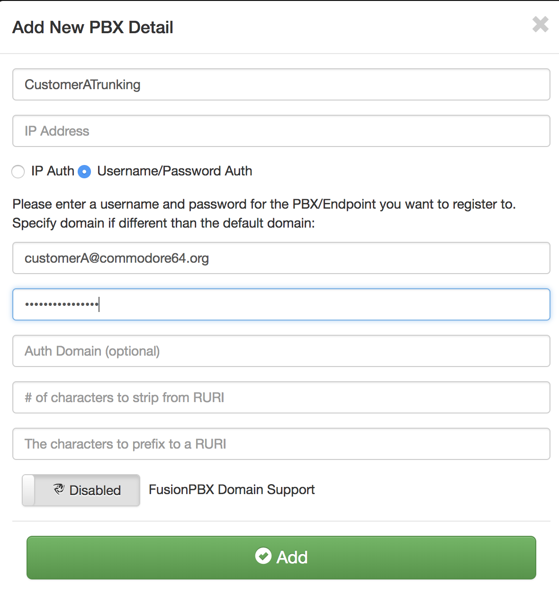
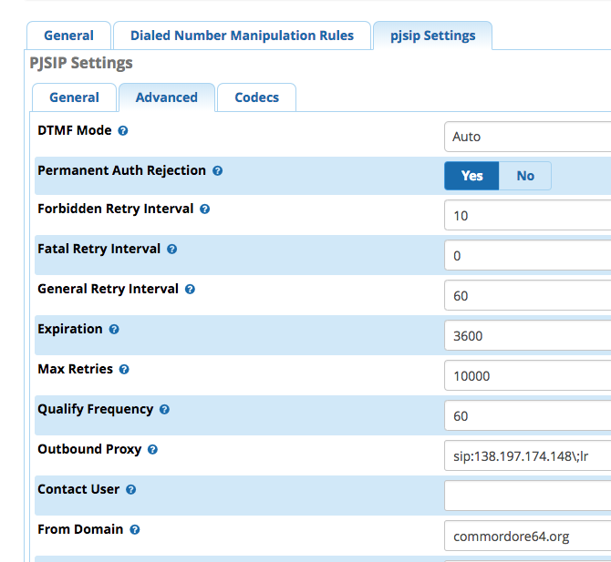
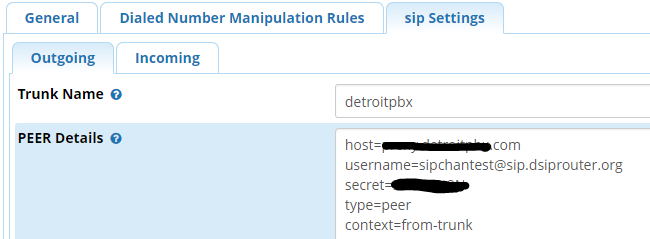
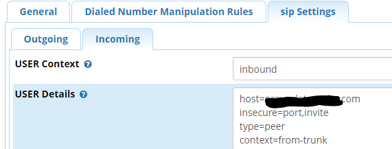
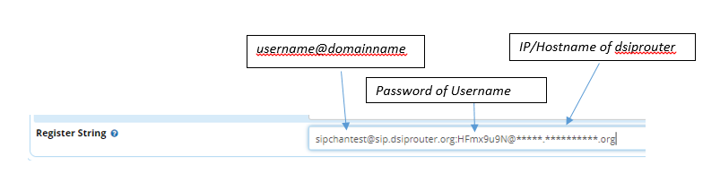
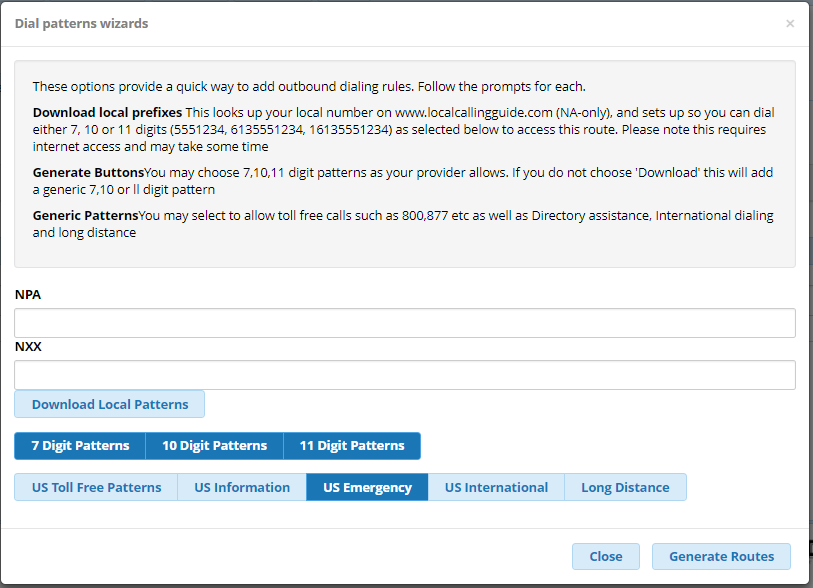
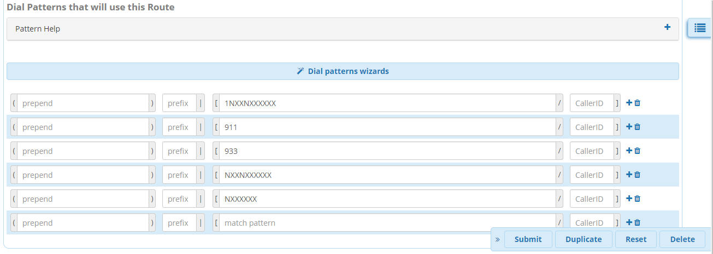
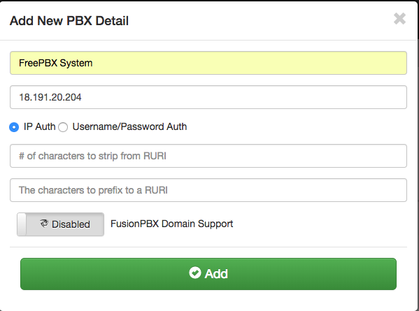
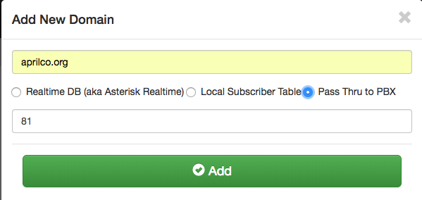
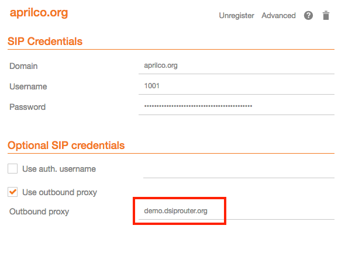

#########
Use Cases
#########
This section contains a list of the common use cases that are implemented using dSIPRouter

====================================
SIP Trunking Using IP Authentication
====================================
dSIPRouter enables an organization to start supporting SIP Trunking within minutes.  Here are the steps to set it up using IP Authenication:

1. Login to dSIPRouter
2. Valiate that your carrier is defined and specified in the Global Outbound Routes.  If not, please follow the steps in :ref:`carrier_groups` and/or :ref:`global_outbound_routes` documentation.  

3. Click on PBX's and Endpoints
4. Click "Add" 
5. Select **IP Authentication** and fill in the fields specified below: 

- Friendly Name
- IP Address of the PBX or Endpoint Device

.. image:: images/sip_trunking_ip_auth.png
        :align: center

6. Click "Add"
7. Click "Reload" to make the change active.

===================================================
SIP Trunking Using Username/Password Authentication 
===================================================

Here are the steps to set it up using Username/Password Authentication:

1. Login to dSIPRouter
2. Valiate that your carrier is defined and specified in the Global Outbound Routes.  If not, please follow the steps in :ref:`carrier_groups` and/or :ref:`global_outbound_routes` documentation.  
3. Click on PBX's and Endpoints
4. Click "Add"  
5. Select  **Username/Password Authentication** and fill in the fields specified below: 

- Friendly Name
- Click the "Username/Password Auth" radio button
- Enter a username  
- Enter a domain. Note, you can make up the domain name.  If you don't specify one then the default domain will be used, which is sip.dsiprouter.org by default.
- Enter a password

6. Click "Add"
7. Click "Reload" to make the change active.

=====================================
Using PJSIP Trunking  - FreePBX Example
=====================================

The following screenshot(s) shows how to configure a PJSIP trunk within FreePBX for Username/Password Authentication.  

The first screenshot shows the General tab of the  "pjsip settings" page:

.. image:: images/sip_trunking_freepbx_pjsip_1.png
        :align: center
        
The following fields needs to be entered

==================   ============
Field                Value
==================   ============
Username             Username from dSIPRouter PBX Setup
Secret		     Password from dSIPRouter PBX Setup
Authentication       Outbound
Registration         Send 
SIP Server           Domain name defined in the dSIPRouter PBX Setup
SIP Server           SIP port, which is 5060 in dSIPRouter
==================   ============

The following fields needs to be entered

==================   ============
Field                Value
==================   ============
Outbound Proxy       IP address of dSIPRouter - must include the "\;lr" at the end
From Domain          The name of the domain defined in the dSIPRouter PBX Setup
==================   ============

=====================================
Using chanSIP Trunking  - FreePBX Example
=====================================
The following screenshot(s) shows how to configure a chanSIP trunk within FreePBX for Username/Password Authentication.

1. Log into FreePBX server
2. Click Connectivity→Trunks
3. Select Add SIP (chan_sip) Trunk
4. Under General tab enter 
  
  The following fields needs to be entered

==================   ============
Field                Value
==================   ============
Trunk Name           Labeled in dsiprouter
Outbound Caller ID   Phone# that you want to appear during a outbound call (if applicable)
==================   ============
 
 
 .. image:: images/sipchan_general.PNG
         :align: center
       

5. Next you will enter the configurations under the SIP Settings. Here you will enter the SIP settings for outgoing calls by selecting the **Outbound** tab. You will need the following information:
The following fields needs to be entered

==================   ============
Field                Value
==================   ============
Host                 <host name or IP address of dsiprouter> 
Username             <Specified in dsiprouter@domainname>
Secret               <Specified in dsiprouter>
Type                 peer
Context              from-trunk
==================   ============

**The domain name has to be included and correct.**

NOTE:** Type <context=from-trunk> underneath the <type=peer> in the Peer Details box if it does not appear.

6. Next you will enter the configurations for incoming by selecting the **Incoming** tab in the SIP Settings. Here you will enter the SIP settings for inbound calls. You will need:

User Context: This is most often the account name or number your provider expects. In this example we named it "inbound".
The following User Details needs to be entered:

==================   ============
Field                Value
==================   ============
Host                 <host name or IP address of dsiprouter>
Insecure             port,invite
Type                 peer
Context              from-trunk
==================   ============

In the **Register String** enter: <username@domainname>:<password>@<ip address **or** hostname>. In this example it would be sipchantest@sip.dsiprouter.org:HFmx9u9N@demo.dsiprouter.org. **The domain name has to be included and correct.**

7. Click Submit

8. Be sure to click the **Apply Config** button after submitting to confirm.

You will now be able to see the new chanSIP added in the truck.	

.. image:: images/add_trunk.PNG
        :align: center
		

		
9. Next you will need to setup an outbound route. Select Connectivity→ Outbound Routes. Click the “+” sign to add a outbound route. In this tab you will need to enter:

=================================   ============
Field                               Value
=================================   ============
Route Name                          Type desired name
Route CID                           Number you want to appear on caller ID
Trunk Sequence for Matched Routes   Trunk name (select from drop down box)
=================================   ============

.. image:: images/outbound_routes_chansip.PNG
        :align: center

10. Click the Dial Patterns tab to set the dial patterns. 
If you are familiar with dial patterns, you can enter the dial patterns manually or you can click the Dial Patterans Wizard to auto create dial patterns if you like. You can choose 7, 10 or 11 digit patterns. Click Generate Routes.

Dial pattern is set to your preference. Prefixes are optional, not required.

11. Click Submit and Apply Config button.

Assuming you already have an extention created in your FreePBX, you can validate incoming/outgoing calls by configuring a softphone or a hard phone. Below is an example of the information you would enter if you use a softphone: In this example we are using Zoiper. Once you’ve downloaded Zoiper application on your PC or smart device you would enter the following to configure the soft phone:
		
==================   ============
Field                Value
==================   ============
Username             <extension>@<siptrunkipaddress>
secret               <Password of that extension>
Hostname	     <IP address of your FreePBX> (should autofill)
==================   ============
**Note** Skip Authenication and Outbound Proxy

.. image:: images/chansip_zoiper.PNG
        :align: center
		
You should now be able to make a inbound and outbound call successfully!
		
		

===============================================
Using SIP Trunking - FusionPBX IP Authenication
===============================================
The following screenshot(s) shows how to configure a SIP trunk within FusionPBX for IP Authenication.

1. Log into your FusionPBX. 
2. Click Accounts --> Gateways-->Click the + sign to add a gateway/SIP Trunk. The only fields you will need to fill here are: 

   - Gateway= Name of the SIP Trunk
   - Proxy= IP address of the SIP trunk
   - Register= Change to False because you are using IP authenication.

.. image:: images/sip_trunking_fusionpbx.PNG
        :align: center

.. image:: images/sip_trunking_fusionpbx_2.PNG
        :align: center

3. Click Save
4. Click DialPlan-->Outboung Routes-->Click the + sign to add a outbound route. Here you will enter in the following fields:

  - Gateway= Name of the SIP Trunk
  - Alternate gateways (if applicable)
  - DialPlan Expression= 11d (standard setup in FusionPBX). To change the dialplan expression click on the dropdown box where it says "Shortcut to create the outbound dialplan entries for this Gateway."
  - Description= (if desired)
 5. Click Save
 
 
 
 .. image:: images/outbound-routes_fusionpbx.PNG
          :align: center
          
         
.. image:: images/outbound-routes_fusionpbx_2.PNG
        :align: center     

**NOTE** To make these changes global for ALL domains for this SIP Trunk: reopen outbound routes and change the Domain to Global and the Context to ${domain_name} as shown below. 

.. image:: images/fusionpbx_global_dialplan.PNG
        :align: center

		
============================================================
Using SIP Trunking - FusionPBX Username/Password Authenication
==============================================================
The following screenshot(s) shows how to configure a SIP trunk within FusionPBX for Username/Password Authenication with IP Authenication off.

1. Log into your FusionPBX. 
2. Click Accounts --> Gateways-->Click the + sign to add a gateway/SIP Trunk. The following fields you will need to fill here are: 

   - Gateway= Name of the SIP Trunk
   - Username= specified by dSIPRouter provider
   - Password= specified by dSIPRouter provider
   - From Domain= Specified or set by default
   - Proxy= IP address of the SIP trunk
   - Register= set to True because you are using Username/Password authenication.
   
   

.. image:: images/sip_trunking_fusionpbx_3.PNG
        :align: center

.. image:: images/sip_trunking_fusionpbx_4.PNG
        :align: center

3. Click Save.
4. Click DialPlan-->Outboung Routes-->Click the + sign to add a outbound route. Here you will enter in the following fields:

  - Gateway= Name of the SIP Trunk
  - Alternate gateways (if applicable)
  - DialPlan Expression= 11d (standard setup in FusionPBX). To change the dialplan expression click on the dropdown box where it says "Shortcut to create the outbound dialplan entries for this Gateway."
  - Description= (if desired)
  
  

 .. image:: images/outbound-routes_fusionpbx.PNG
          :align: center
          
         
.. image:: images/outbound-routes_fusionpbx_2.PNG
        :align: center     

  
  
 
 5. Click Save

=================
FusionPBX Hosting
=================

 Here we will demostrate how to setup dSIPRouter to enable hosting FusionPBX. We have built-in support for FusionPBX that allows domains to be dynamically pulled from FusionPBX.
 
1. Login to dSIPRouter
2. Click PBX(s) and EndPoints
3. Click ADD; enter the following fields
 
  - Friendly Name (opional)
  - IP address
  - IP Auth
  - Click to enable FusionPBX Domain Support
  - FusionPBX Database IP or Hostname
4. Click ADD

   
.. image:: images/fusionpbx_hosting.PNG
        :align: center
          
5. Click Reload Kamailio. (when changes are made reload button will change to orange)          
    
.. image:: images/reload_button.PNG
        :align: center    
       
          
6. Access your FusionPBX database via ssh.

7.Run the command as illustrated in the "Edit your PBX Detail" window as root on the FusionPBX server. Replace <ip address> (not including the brackets) with the IP address of the dSIPRouter server you're adding. Command line will look simulair to the following picture. 
**NOTE** After you have entered the first two lines of commands you will not see a form of reply. If command is entered correctly it will return back to your root line. If the command line is incorrect you will receive a "command not found" error message. Recheck the command line and IP address.

 .. image:: images/fusionpbx_domain_support.PNG
          :align: center
        

After the command is run you should now be able to see the domains of that PBX in dSIPRouter.
        

.. image:: images/list_of_domain.PNG
        :align: center
        

        

You can test PBX Hosting is valid by configuring a softphone or a hard phone. Below is an example using a softphone: 
 
 Now that domains have been synced in dSIPRouter you are able to register a softphone. In this example we are using Zoiper.
 Once you've downloaded Zopier appliaction on your PC or smart device you would add:
 
 - username (extension@domainname)
 - password (password of that extension)
 - outbound proxy (IP address of the dSIPRouter)
 
 
 .. image:: images/zoiper_screenshot.PNG
        :align: center 
        
================================================
Provisioning and Registering a Polycom VVX Phone
================================================
 
 Now that domains have been synced in dSIPRouter you are able to register a endpoint/hard-phone. In this example we are using a Polycom VVX410 desk phone.
 
1. Log into your FusionPBX box
 
     a) Update the "outboundProxy.address" of the template with the IP address or hostname of the dSIPRouter in the provisioning editor.
     

 .. image:: images/outbound_proxy.PNG
         :align: center
         
2.  Assign the phone to a template.       
 
 .. image:: images/assign_template.PNG
         :align: center
        
3. Configuring the Provisioning Server section of the phone. Enter the appropriate information into the fields.

 a) Server Type (dSIPRouter uses HTTP by default)
 
 b) Server Address
 
 c) Server Username (device provisioning server name)
 
 d) Server Password
 
4. Click Save 
 
 .. image:: images/provisioning_server.PNG 
          :align: center
        
5. Reboot the phone
         
          
 
==========================================
FreePBX Hosting - Pass Thru Authentication
==========================================

Here we will demostrate how to setup dSIPRouter to enable hosting FreePBX using Pass Thru Authentication. FreePBX is designed to be a single tenant system or in other words, it was built to handle one SIP Domain.  So, we use dSIPRouter to define a SIP Domain and we pass thru Registration info to the FreePBX server so that you don't have to change how authentication is done.  However, this will only work for one FreePBX server.  If you have a cluster of FreePBX servers then use "Local Subscriber Table" authentication.  The value of having dSIPRouter in front of FreePBX is to provide you with flexibility.  After setting this up you will have the ability upgrade or migrate users from one FreePBX instance to another without having to take an outage.  The following video shows how to configure this.  The steps to implement this is below the video.

.. raw:: html
        
        <object width="560" height="315"><param name="movie"
        value="https://www.youtube.com/embed/OgTZLYYx1u8"></param><param
        name="allowFullScreen" value="true"></param><param
        name="allowscriptaccess" value="always"></param><embed
        src="https://www.youtube.com/embed/OgTZLYYx1u8"
        type="application/x-shockwave-flash" allowscriptaccess="always"
        allowfullscreen="true" width=""
        height="385"></embed></object>

------------------
Steps to Implement
------------------
1. Click PBX and Endpoints
2. Click Add

          
3. Reload Kamailio

4. Click Domains
5. Click Add

          
6. Reload Kamailio

7. Register a phone via dSIPRouter - notice that we used the hostname of dSIPRouter as the Outbound Proxy.  This forces the registration thru the proxy.

