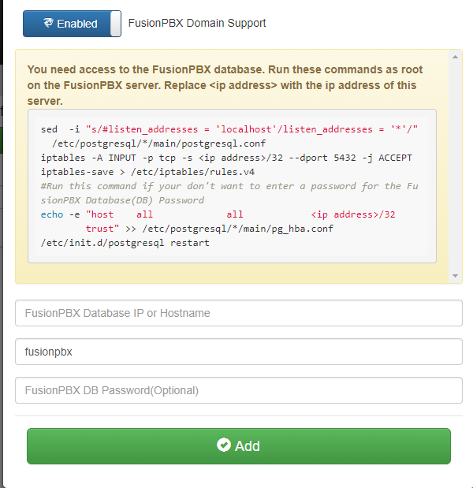

#########
Use Cases
#########
This section contains a list of the common use cases that are implemented using dSIPRouter

====================================
SIP Trunking Using IP Authentication
====================================
dSIPRouter enables an organization to start supporting SIP Trunking within minutes.  Here are the steps to set it up using IP Authenication:

1. Login to dSIPRouter
2. Valiate that your carrier is defined and specified in the Global Outbound Routes.  If not, please follow the steps in :ref:`carrier_groups` and/or :ref:`global_outbound_routes` documentation.  

3. Click on PBX's and Endpoints
4. Click "Add" 
5. Select **IP Authentication** and fill in the fields specified below: 

- Friendly Name
- IP Address of the PBX or Endpoint Device

.. image:: images/sip_trunking_ip_auth.png
        :align: center

6. Click "Add"
7. Click "Reload" to make the change active.

===================================================
SIP Trunking Using Username/Password Authentication 
===================================================

Here are the steps to set it up using Username/Password Authentication:

1. Login to dSIPRouter
2. Valiate that your carrier is defined and specified in the Global Outbound Routes.  If not, please follow the steps in :ref:`carrier_groups` and/or :ref:`global_outbound_routes` documentation.  
3. Click on PBX's and Endpoints
4. Click "Add" 
5. Select  **Username/Password Authentication** and fill in the fields specified below: 

- Friendly Name
- Click the "Username/Password Auth" radio button
- Enter a username  
- Enter a domain. Note, you can make up the domain name.  If you don't specify one then the default domain will be used, which is sip.dsiprouter.org by default.
- Enter a password

.. image:: images/sip_trunking_credentials_auth.png
        :align: center

6. Click "Add"
7. Click "Reload" to make the change active.

=====================================
Using SIP Trunking  - FreePBX Example
=====================================

The following screenshot(s) shows how to configure a PJSIP trunk within FreePBX for Username/Password Authentication.  

The first screenshot shows the General tab of the  "pjsip settings" page:

.. image:: images/sip_trunking_freepbx_pjsip_1.png
        :align: center
        
The following fields needs to be entered

==================   ============
Field                Value
==================   ============
Username             Username from dSIPRouter PBX Setup
SIP Server           Domain name defined in the dSIPRouter PBX Setup
SIP Server           SIP port, which is 5060 in dSIPRouter
==================   ============

.. image:: images/sip_trunking_freepbx_pjsip_2.png
        :align: center

The following fields needs to be entered

==================   ============
Field                Value
==================   ============
Outbound Proxy       IP address of dSIPRouter - must include the "\;lr" at the end
From Domain          The name of the domain defined in the dSIPRouter PBX Setup
==================   ============

===============================================
Using SIP Trunking - FusionPBX IP Authenication
===============================================
The following screenshot(s) shows how to configure a SIP trunk within FusionPBX for IP Authenication.

1. Log into your FusionPBX. 
2. Click Accounts --> Gateways-->Click the + sign to add a gateway/SIP Trunk. The only fields you will need to fill here are: 

   - Gateway= Name of the SIP Trunk
   - Proxy= IP address of the SIP trunk
   - Register= Change to False because you are using IP authenication.

.. image:: images/sip_trunking_fusionpbx.PNG
        :align: center

.. image:: images/sip_trunking_fusionpbx_2.PNG
        :align: center

3. Click Save
4. Click DialPlan-->Outboung Routes-->Click the + sign to add a outbound route. Here you will enter in the following fields:

  - Gateway= Name of the SIP Trunk
  - Alternate gateways (if applicable)
  - DialPlan Expression= 11d (standard setup in FusionPBX). To change the dialplan expression click on the dropdown box where it says "Shortcut to create the outbound dialplan entries for this Gateway."
  - Description= (if desired)
 5. Click Save
 
 
 
 .. image:: images/outbound-routes_fusionpbx.PNG
          :align: center
          
         
.. image:: images/outbound-routes_fusionpbx_2.PNG
        :align: center     

**NOTE** To make these changes global for ALL domains for this SIP Trunk: reopen outbound routes and change the Domain to Global and the Context to ${domain_name} as shown below. 

.. image:: images/fusionpbx_global_dialplan.PNG
        :align: center

==============================================================
Using SIP Trunking - FusionPBX Username/Password Authenication
==============================================================
The following screenshot(s) shows how to configure a SIP trunk within FusionPBX for Username/Password Authenication with IP Authenication off.

1. Log into your FusionPBX. 
2. Click Accounts --> Gateways-->Click the + sign to add a gateway/SIP Trunk. The following fields you will need to fill here are: 

   - Gateway= Name of the SIP Trunk
   - Username= specified by dSIPRouter provider
   - Password= specified by dSIPRouter provider
   - From Domain= Specified or set by default
   - Proxy= IP address of the SIP trunk
   - Register= set to True because you are using Username/Password authenication.
   
   

.. image:: images/sip_trunking_fusionpbx_3.PNG
        :align: center

.. image:: images/sip_trunking_fusionpbx_4.PNG
        :align: center

3. Click Save.
4. Click DialPlan-->Outboung Routes-->Click the + sign to add a outbound route. Here you will enter in the following fields:

  - Gateway= Name of the SIP Trunk
  - Alternate gateways (if applicable)
  - DialPlan Expression= 11d (standard setup in FusionPBX). To change the dialplan expression click on the dropdown box where it says "Shortcut to create the outbound dialplan entries for this Gateway."
  - Description= (if desired)
  
  

.. image:: images/11d_dialplan.PNG 
          :align: center  
          

.. image:: images/11d_dialplan2.PNG
        :align: center

  
  
 5. Click Save

===========
FusionPBX Hosting
===========

 Here we will demostrate how to setup dSIPRouter to enable hosting a PBX. In the following example we have multi domain support built-in PBX.
 
 1. Login to dSIPRouter
 2. Click PBX(s) and EndPoints
 3. Click ADD; enter the following fields
 
  - Friendly Name (opional)
  - IP address
  - IP Auth
  - Click to enable FusionPBX Domain Support
  - FusionPBX Database IP or Hostname
  - Click ADD
  
.. image:: images/fusionpbx_hosting.PNG
        :align: center
          
          

 
 ^^^^^^^^^
 Asterisk or FreePBX
 ^^^^^^^^^^^^^^^^^^^
 
